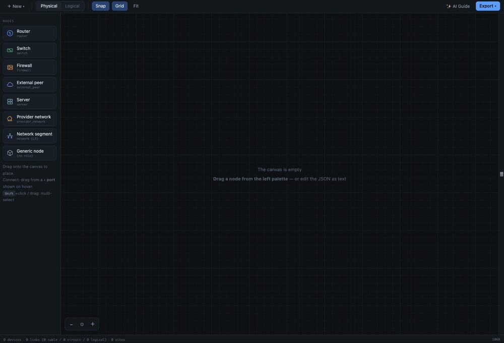
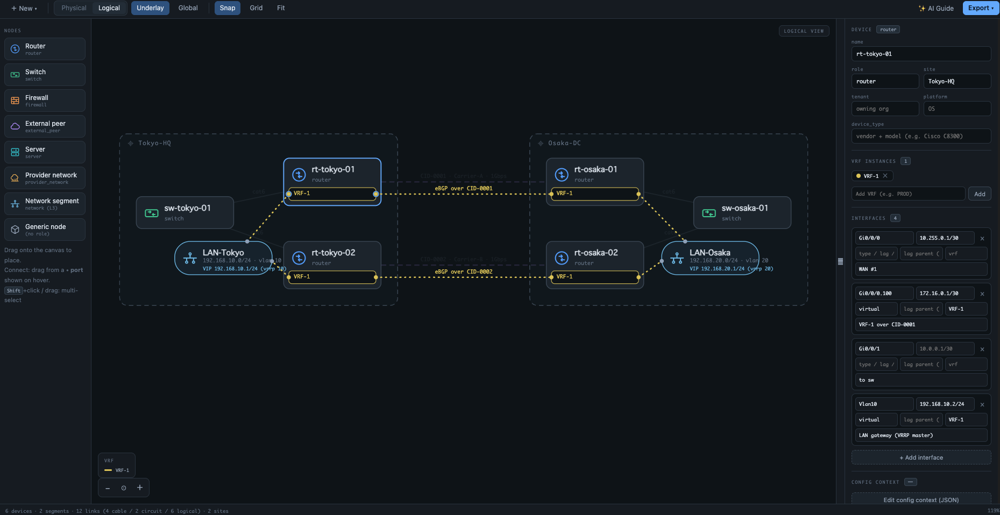

# TopoDraft — Network Topology as Code

[English](README.md) | **日本語**

[](https://github.com/kazukifujiwara/network-topo-draft/actions/workflows/ci.yml)
[](LICENSE)
[](https://marketplace.visualstudio.com/items?itemName=kazukifujiwara.topodraft)
[](https://www.npmjs.com/package/topodraft-cli)


`*.topo.json`(別名: `*.topo`)ファイルのためのグラフィカルなネットワークトポロジエディタで、
VSCode のカスタムエディタとして動作します。ファイルを開くとキャンバスが起動し、
デバイス・ケーブル・キャリア回線・論理(L3/VRF)隣接を描けます —
**キャンバスに対して権威を持つのはテキストドキュメント**(図はそのビューにすぎません)なので、
AI エージェント(GitHub Copilot、Claude Code、NetBox-MCP 駆動のエージェントなど)が
同じファイルをテキストとして編集すると、キャンバスがそれに追従します。



*AI エージェントが JSON を編集して2拠点ネットワークを構築 — キャンバスが一手ごとにライブで追従します。*



*論理ビュー: VRF コンパートメント、L3 隣接、マルチアクセス VRRP セグメント — すべて同じファイルで編集できます。*

このリポジトリは、スタンドアロン HTML 版エディタ(v7 で凍結、[`reference/`](reference/) に
そのまま保存)を、純粋な TypeScript パッケージのモノレポとして再構築したものです。

- ファイル形式仕様: [`docs/topodraft-file-format-v1.md`](docs/topodraft-file-format-v1.md)
  — `*.topo.json` を読み書きするエージェントにとっての規範的な契約
- 公開 JSON Schema: [`schema/topodraft.schema.json`](schema/topodraft.schema.json)
- 開発計画と ADR: [`docs/topodraft-vscode-plan.md`](docs/topodraft-vscode-plan.md)

## リポジトリ構成

```
packages/
  core/        DOM にも Node にも依存しない純粋 TypeScript: モデル、parse(レガシー
               形式の吸収)、正準 serialize、validate(診断)、operations、geometry、
               generators(markdown / for-ai / schema / draw.io / svg)
  webview-ui/  キャンバス UI: シーン描画、操作、パネル、ツールバー
               (jsdom でテスト。ホストとはプロトコルメッセージのみで通信)
  extension/   VSCode 拡張ホスト: カスタムエディタ、同期ループ、診断、
               コマンド、テンプレート、エージェントガイド
  cli/         `topodraft` コマンド(パッケージ名: topodraft-cli): エディタの検証を
               CLI 化したもの。ヘッドレス環境・AI エージェント向け
  mcp/         `topodraft-mcp` MCP サーバー: 読み取り / 検証 / 編集 / 描画ツールで
               AI エージェントがこのフォーマットをネイティブに扱う
  protocol/    Webview ⇔ ホスト間メッセージ型(共有)
schema/        形式 v1 の公開 JSON Schema
fixtures/      ゴールデンファイル: レガシー v3–v7 のエクスポート形 + v1 正準形
docs/          開発計画とファイル形式仕様
reference/     凍結された v7 スタンドアロン HTML エディタ(変更禁止)
```

## 開発

Node.js ≥ 20 が必要です。

```sh
npm install
npm test               # 全パッケージの全テストを実行(vitest)
npm run test:coverage  # 同上 + core のカバレッジ閾値を強制(計画 §6.3)
npm run test:e2e       # VSCode 統合テスト(@vscode/test-electron)
npm run lint           # eslint(core のブラウザ純粋性ルールを含む)
npm run typecheck
npm run build          # 拡張ホスト + webview をバンドル(esbuild)
npm run package        # packages/extension/topodraft-<version>.vsix を生成
```

インストールは [Visual Studio Marketplace](https://marketplace.visualstudio.com/items?itemName=kazukifujiwara.topodraft)
から(拡張機能パネルで「TopoDraft」を検索)。開発ビルドの場合:
拡張機能パネル → `…` メニュー → **Install from VSIX…** — CI が毎 push で
VSIX をワークフローアーティファクトとしてアップロードしています。

> **同一バージョンの VSIX を再インストールした場合**は、その後必ず
> **「Developer: Reload Window」**を実行してください — ウィンドウを再読み込みするまで、
> 実行中の拡張ホストは古いコードをメモリに保持したままです(検出時はキャンバスに
> 再読み込みを促すヒントが表示されます)。

### エディタを試す

インストール後、VSCode の Welcome ページに表示される
**「TopoDraft をはじめる」ウォークスルー**が、最初のトポロジ作成から
AI エージェント連携までを案内します(「Welcome: Open Walkthrough…」で
いつでも再表示できます)。

このリポジトリを VSCode で開いて **F5**(「Run TopoDraft Extension」)を押すと、
Extension Development Host が `fixtures/` を開いた状態で起動します。そこにある
`*.topo.json` を開いてください。

- **描画**: パレットからノード種別をドラッグ配置し、ホバーで表示される ◦ ポートから
  ドラッグして結線(同一サイト → ケーブル、サイト間またはプロバイダ網 → 回線。
  論理ビューでは VRF コンパートメント間のドラッグで論理リンク)。
- **マルチアクセス L3 セグメント**(形式仕様 §3.10): `networks[]` のエントリは論理ビューに
  ピル型ノードとして描画されます — 複数デバイスが共有するサブネットで、FHRP
  (HSRP/VRRP)グループと仮想 IP を持てます。接続する各デバイスは
  `{ "network": "<name>" }` エンドポイントの論理リンクを1本ずつ持ちます。
- **編集**: デバイス / プロバイダ網 / セグメント / リンクのプロパティパネル、VRF チップ、
  インターフェイスカード、JSON Config Context モーダル、右クリックのコンテキストメニュー、
  ダブルクリックでリネーム(参照は自動追従)、コピー / ペースト / 複製、整列 / 分散、
  矢印キーでの微調整。プロパティパネルは端のストリップボタンで折りたたんで
  キャンバスを全幅にでき、何かを選択すると再び開きます。
- **Undo / Redo は素の VSCode**(`Ctrl/Cmd+Z`): キャンバスの1コミットはテキスト
  ドキュメントへの1つの `WorkspaceEdit` であり、エディタ内部の履歴は存在しません。
- **エージェントフレンドリー**: 分割ビューで JSON をテキストとして編集すると
  (`TopoDraft: Open as Text`、エディタタイトルバーの `</>` ボタンでも可)、キャンバスが
  追従します。古いドキュメントバージョンを基に計算されたキャンバス編集は破棄され、
  エージェントの編集を上書きすることはありません。JSON が編集途中で不正な間は
  キャンバスが薄暗くなって編集が一時停止し、正常に戻ると自動で再開します(ADR D11)。
- **Problems パネル**: 意味的な診断(名前の重複、参照切れ、LAG 親の欠落、存在しない
  インターフェイス、未宣言 VRF、セグメントの prefix 外の IP、version 欠落、そして
  タイポしたフィールドへの did-you-mean 提案 — `"ip"` → `"ip_address"`)が、問題箇所を
  正確に指すレンジ付きで表示されます — AI エージェントの自己修正ループの入口です。
  `TopoDraft: Validate` でオンデマンド実行もできます。
- **エージェントに形式を先に教える**: `TopoDraft: Write AI Agent Guide (AGENTS.md)`
  — ツールバーの ✨ AI Guide ボタンからも — が、ファイル形式の完全な契約
  (ルール + JSON Schema + 例)をワークスペースに書き出します。コーディングエージェント
  (Claude Code、Copilot など)はこれを自動で読み取ります(マーカー方式の冪等な
  セクション。「Save as…」で別ファイルへの書き出しも可)。新規ファイルには公開スキーマを
  指す `$schema` URL も埋め込まれます。
- **コマンド**: `Open Example Topology`(同梱サンプルから即キャンバス — 無題
  ドキュメントなのでファイルの準備不要)、`New Topology File`(ビルトインテンプレート +
  自作テンプレート — `topodraft.templatesFolder`(既定 `.topodraft/templates`)配下の
  任意の `*.topo.json`)、`Save as Template`、`Export as Markdown / for AI /
  Import-Schema / draw.io / Image (SVG, PNG)`。画像エクスポートは現在のビュー
  (物理 / 論理)をエディタの見た目のまま書き出します — PNG の倍率は
  `topodraft.pngExportScale` で設定。よく使うものはキャンバスのツールバーにもあります:
  **＋ New**(テンプレートメニュー)と **Export** のドロップダウン。
- **言語**: UI は VSCode の表示言語に追従します(英語 / 日本語)。

## CLI での検証(`topodraft validate`)

ヘッドレス環境 — CI パイプラインや VSCode の外で動く AI エージェント — でも、
エディタの Problems パネルとまったく同じ診断が使えます:

```sh
npx topodraft-cli validate network/*.topo.json   # npx topodraft validate でも可
```

```
network/dc-east.topo.json:14:22 error dangling-reference Endpoint references device "ghost", …
network/dc-east.topo.json:9:31 warning unknown-field Unknown field "ip" — did you mean "ip_address"? …
```

- JSON 構文 → トポロジ形状 → 意味的ルール → 未知フィールド(did-you-mean 付き)を、
  それぞれ `file:line:col` 付きで検査
- `--json` で機械可読出力、`--strict` で警告も失敗扱い、
  終了コードは 0 / 1 / 2(クリーン / 検出あり / 使用法・IO エラー)
- ランタイム依存は拡張に同梱済みのもの(core + jsonc-parser、バンドル済み)以外ゼロ

## MCP サーバー(`topodraft-mcp`)

AI エージェントは [MCP](https://modelcontextprotocol.io) 経由でこのフォーマットを
ネイティブに扱えます: フォーマットの学習(`describe_format`)、読み取り・検証
(`read_topology` / `validate_topology`)、編集後の診断が毎回の応答に含まれる
構造化編集(`add_device`、`add_link`、`update_device` …)、そして図を*見る*
(`render_svg` — エディタの画像エクスポートと同一の SVG)。VSCode で開いている
ファイルを編集すると、キャンバスがライブで追従します。

```sh
claude mcp add topodraft -- npx -y topodraft-mcp   # Claude Code の例。任意の MCP クライアントで動作
```

推奨ワークフロー: 一括作成は JSON ファイルを直接生成、小さな変更は編集ツール、
変更後は必ず検証、レイアウト確認は `render_svg`。編集ツールを完全に無効化する
`--read-only` 起動もあります。詳細: [packages/mcp](packages/mcp/README.md)。

## テストポリシー

挙動を追加・変更するすべての PR は、その変更に対するテストを追加し、**かつ**既存の
テストスイート全体を green に保たなければなりません(計画 §6.1)。既存テストの変更・
削除は仕様変更であり、PR の説明で明示的に宣言する必要があります。

**ブランチ保護で `CI` ワークフローを必須ステータスチェックに指定してください** —
このポリシーを慣習ではなく仕組みで強制するためです。

テストのレイヤー(計画 §6.2):

1. core の単体テスト(モデル操作、参照追従リネーム、VRF 導出、ジオメトリ、ジェネレータ)
2. ゴールデンファイル互換性: `fixtures/` の全フィクスチャが
   `parse → normalize → serialize` でコミット済みの期待出力と一致し、その結果が
   `schema/topodraft.schema.json` に対して valid であること
3. シリアライザの決定性: ラウンドトリップ等価、バイトレベルの冪等性、
   正準キー順 / 改行 / インデント規則
4. validate / 診断: ルールごとの検出と非検出

## サードパーティソフトウェア(サプライチェーン)

VSIX に含まれるものはすべてビルド時にバンドルされます — パッケージに
`node_modules` は含まれず、実行時に何もインストールしません。

| 範囲 | ライブラリ | ライセンス | 用途 |
| --- | --- | --- | --- |
| 拡張ホストにバンドル | [jsonc-parser](https://github.com/microsoft/node-jsonc-parser) | MIT | Problems パネルの診断のために JSON パスをテキストレンジへ解決 |

ランタイムの依存はこれで全部です: `packages/core`、`packages/protocol`、webview
バンドルは**外部依存ゼロ**(純粋性テストと ESLint ルールで強制)。`package-lock.json` に
あるその他はすべて開発ツールチェーン(TypeScript、esbuild、vitest、ESLint、
@vscode/test-electron + mocha、@vscode/vsce)であり、出荷されることはありません。

ご自身で検証できます:

```sh
npm ls --omit=dev --all     # ランタイム依存ツリーの全体
npm audit --omit=dev        # 出荷される依存に対する脆弱性勧告
npx vsce ls                 # VSIX に入るものの正確な一覧
```

CI は毎 push で `npm audit --omit=dev`(全深刻度)と、開発ツールチェーンに対する
High 以上のゲートを実行します。

## プライバシー

この拡張はテレメトリを収集せず、リモートコードを読み込みません。

## ライセンス

[Apache License 2.0](LICENSE) — Copyright 2026 Kazuki Fujiwara。
利用・改変・再配布が可能な寛容ライセンスで、明示的な特許許諾を含みます。
TopoDraft の名称はライセンスされません(Apache-2.0 §6)。
